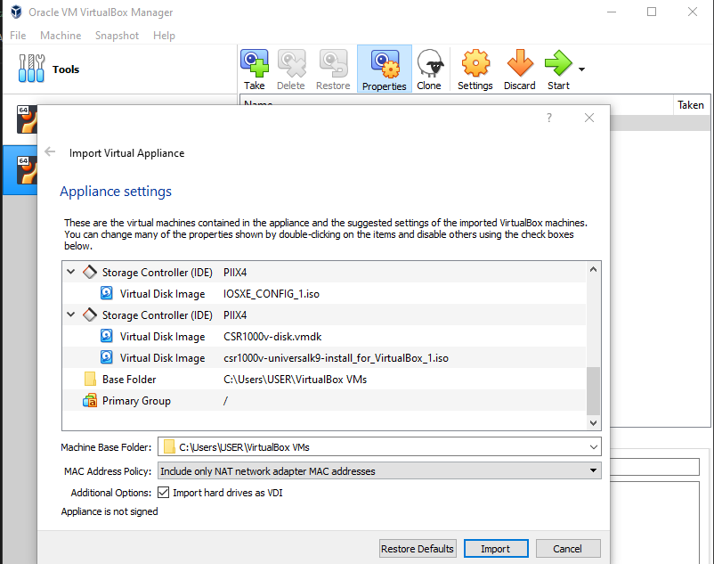
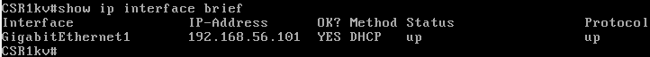

# Instalación de la VM CSR-1000v (router virtual)

Guía: 

https://itexamanswers.net/7-0-3-lab-install-the-csr1000v-vm-answers.html

## Parte 1. Instalar la VM CSR1000v en VirtualBox




En esta fase el proceso de instalación demora bastante. No tocamos nada hasta que dejan de llegar nuevos mensajes:


Lo único que hay que hacer presionar la tecla enter. Nos saldrá una línea de comandos. Introducimos el comando `enable`:


## Parte 2. Verificando comunicaciones a la VM CSR1000v

```
show ip interface brief
```

