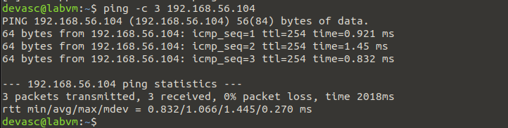
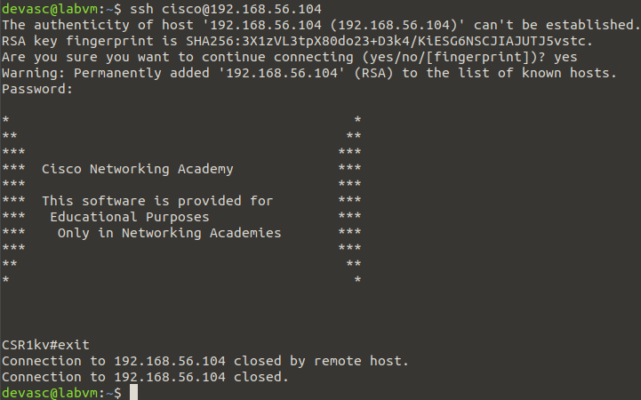
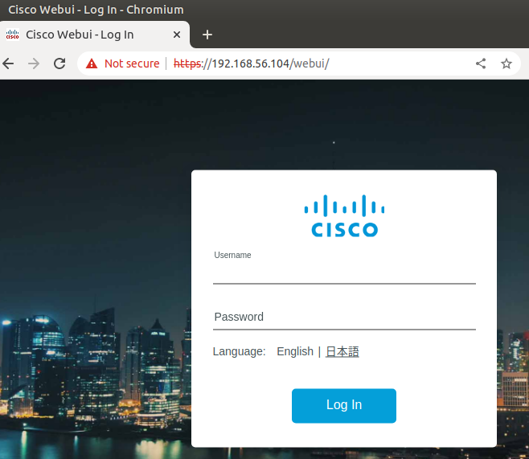
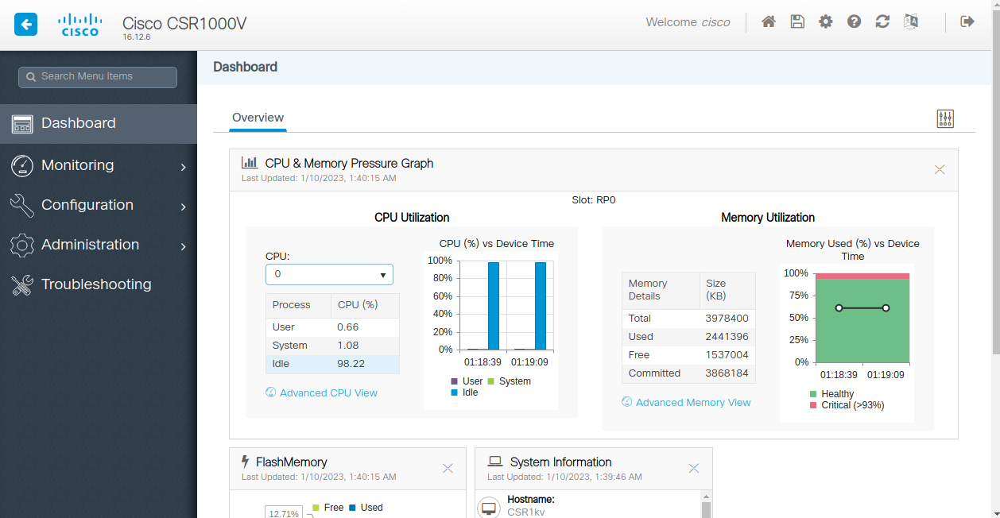
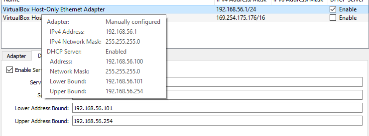
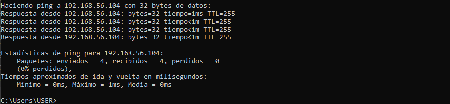

# Instalación de la VM CSR-1000v (router virtual)

Guía: 

https://itexamanswers.net/7-0-3-lab-install-the-csr1000v-vm-answers.html

## Parte 1. Instalar la VM CSR1000v en VirtualBox

Importamos la VM a VirtualBox:


Ya podemos iniciar la VM. Esta fase del proceso de instalación demora bastante. No tocamos nada hasta que dejan de llegar nuevos mensajes...


Lo único que hay que hacer presionar la tecla enter. Nos saldrá una línea de comandos. Introducimos el comando `enable` para poder desbloquear comandos:


## Parte 2. Verificando comunicaciones a la VM CSR1000v

```
show ip interface brief
```


En este punto tuvimos un problema que parecía irresoluble. No era posible hacerle ping a CSR1kv. Afortunadamente se resolvió. Se muestra en la sección de dificultades y soluciones.

A continuación probamos la conectividad lanzando un comando ping desde la VM Devasc a nuestra CSR1kv. Vemos que los tres paquetes que enviamos fueron recibidos:



Habiendo comprabado la conectividad de la red, intentaremos establecer una sesión SSH es Devasc para controlar desde ahí nuestro router virtual CSR1kv.

En Devasc:

```
ssh cisco@<ip_router>
```

La contraseña que usamos es _cisco123!_ Luego salimos con el comando `exit`.



Ahora nos conectaremos al router por una vía distinta: la interfaz web de Cisco. Solo introlducimos en el navegador web la URL https://\<ip-router> y, si dice que es una conexión insegura, como fue nuestro caso, buscamos la opciones avanzadas para permitirla. 



Username: cisco

Password: cisco123!



## Dificultades y soluciones

### Problemas con el adaptador host-only

Máquina Host:


Devasc (VM):


Instalé una tercera vez el router virtual y volvió a ocurrir lo mismo.

Aquí está toda la info del sistema:


En cuanto a la configuración de la red en Virtual Box, no he tocado nada como dice la guía que seguí. Este es el adaptador host-only que está activado y conectado con la CSR1kv por defecto:


La solución fue actualizar Virtual Box. Pasamos de la versión 6.1.38 a la  6.1.40. Y quizás lo que lo cambió todo fue que el adaptador host-only con el que vino cambió:



Si no hubiera tenido una versión desactualizada, quizás también hubiera tenido el mismo problema, ya que lo que estaba mal al parecer era la configuración de este adaptador.

Con esta configuración pude hacer un ping desde mi máquina host:

