# Instalación de la VM CSR-1000v (router virtual)

Guía: 

https://itexamanswers.net/7-0-3-lab-install-the-csr1000v-vm-answers.html

## Parte 1. Instalar la VM CSR1000v en VirtualBox

Importamos la VM a VirtualBox:

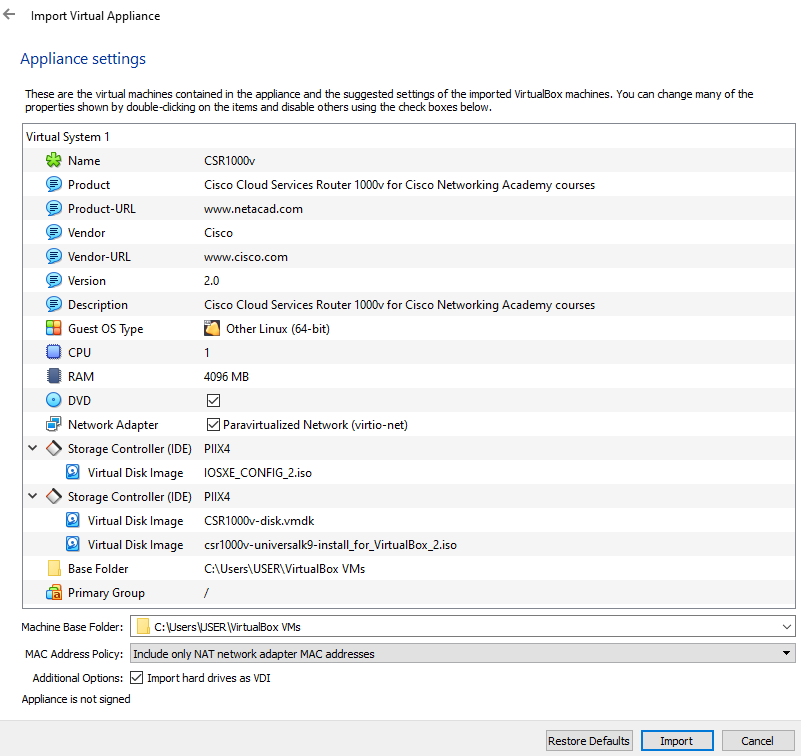


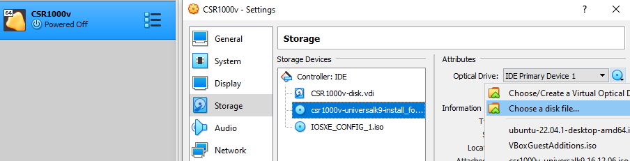

Ya podemos iniciar la VM. Esta fase del proceso de instalación demora bastante. No tocamos nada hasta que dejan de llegar nuevos mensajes...

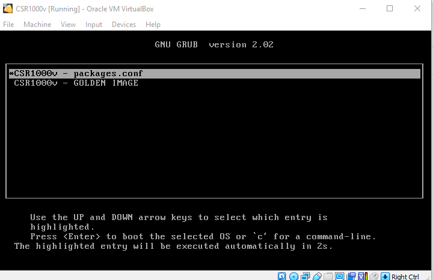

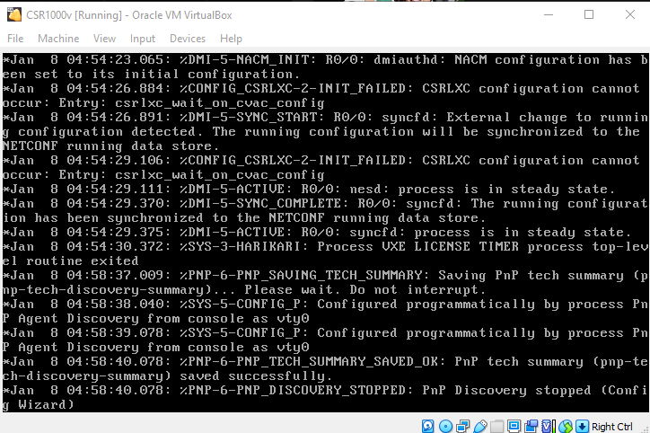

Lo único que hay que hacer presionar la tecla enter. Nos saldrá una línea de comandos. Introducimos el comando `enable` para poder desbloquear comandos:


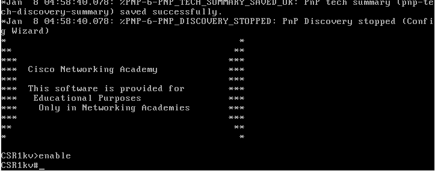

## Parte 2. Verificando comunicaciones a la VM CSR1000v

```
show ip interface brief
```

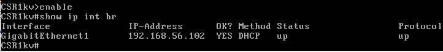

Hasta aquí llegamos, porque no es posible hacerle ping, como se ve en la siguiente sección.

## Problemas

Máquina Host:

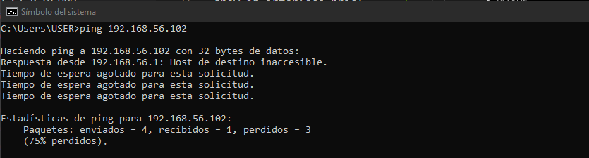

Devasc (VM):

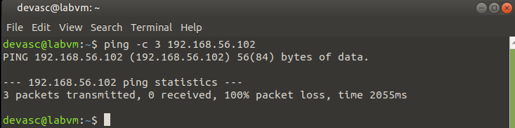

Instalé una tercera vez el router virtual y volvió a ocurrir lo mismo.

Aquí está toda la info del sistema:

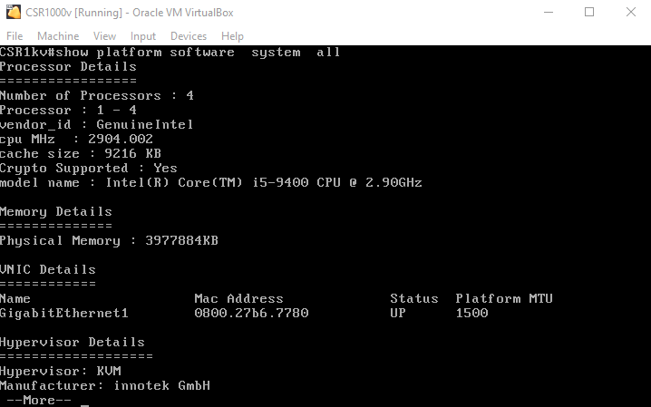

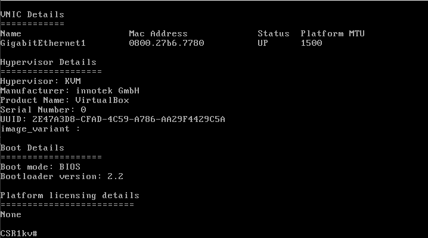

En cuanto a la configuración de la red en Virtual Box, no he tocado nada como dice la guía que seguí. Este es el adaptador host-only que está activado y conectado con la CSR1kv por defecto:


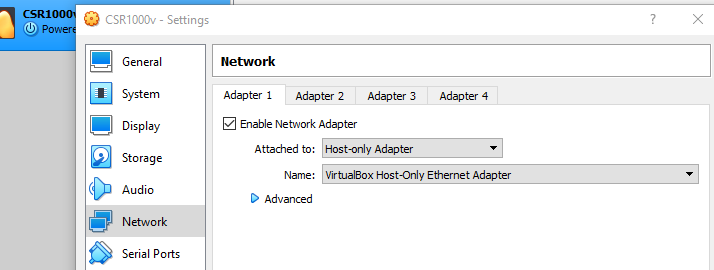