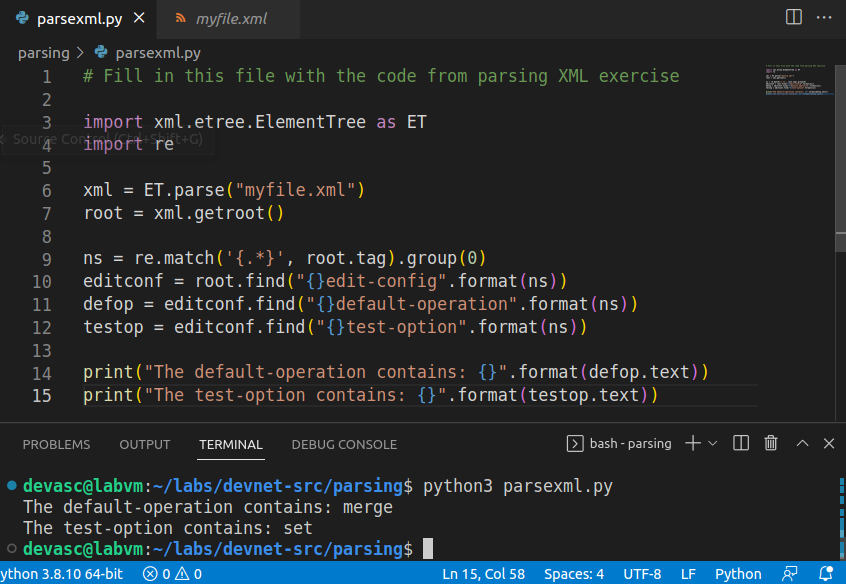
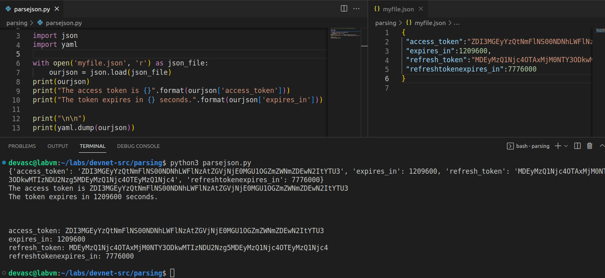

# Lab 3b. Analizar (parse) archivos XML, JSON y YAML con Python

Guía en inglés: https://contenthub.netacad.com/courses/devnet/_common/3.6.6-lab---parse-different-data-types-with-python.pdf

Video orientativo: https://www.youtube.com/watch?v=o-oWrnchWb4

## Parte 2. Analizar XML en Python



## Parte 3. Analizar JSON en Python

Instalamos los módulos para trabajar con JSON y YAML en Python con los siguientes comandos:

```
sudo apt-get install -y libjson-perl
sudo apt-get -y install python-yaml
```



## Parte 4. Analizar YAML en Python


