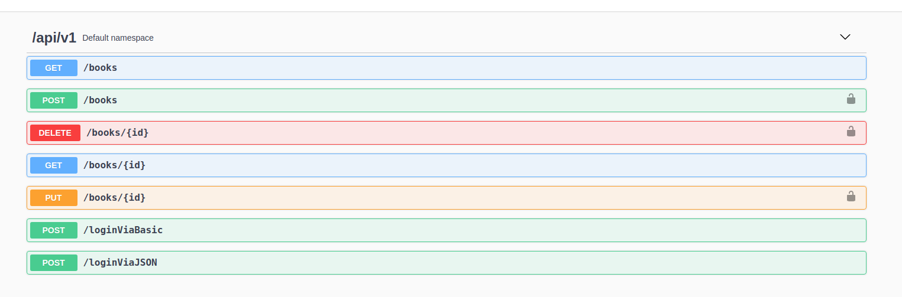
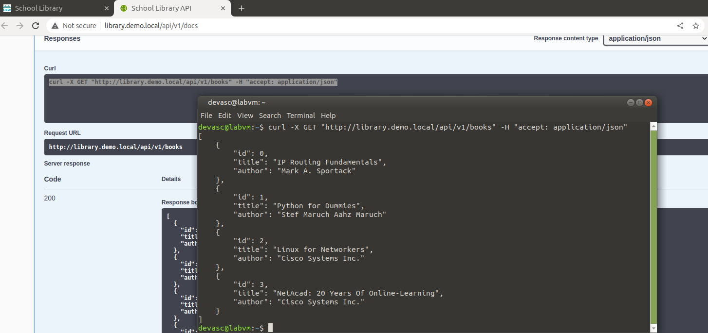
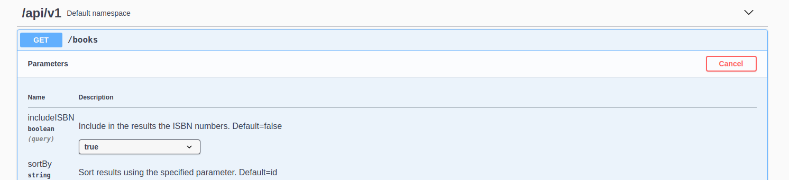
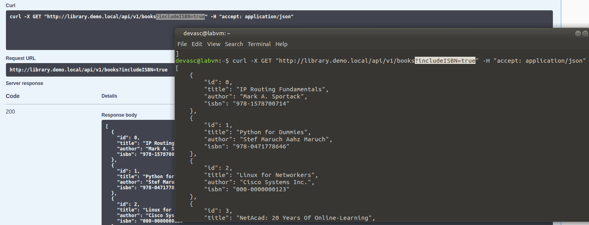
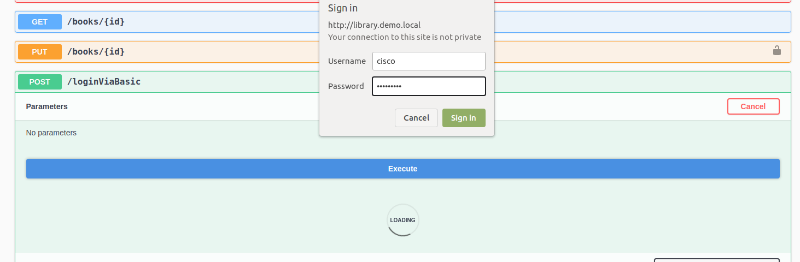
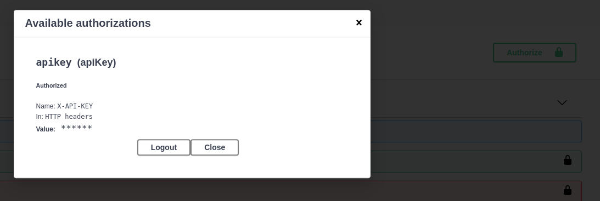
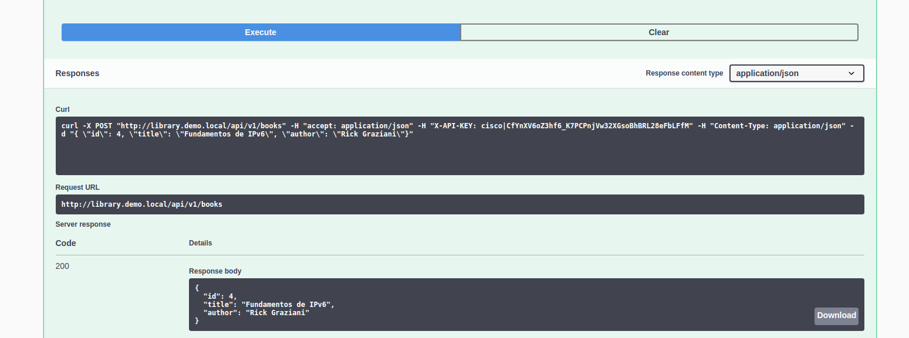
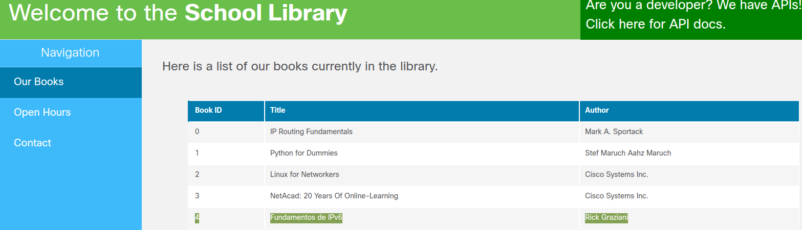

# Laboratorio 4a. Explorando REST API con API Simulator y Postman

## Parte 2. Explorar la documentación API usando el simuldaor de API

http://library.demo.local/

### GET /books

Establecemos el parámetro _includeISBN_ en True para que aparezca en los resultados.

### POST /loginViaBasic

Con esta API nos autenticamos para usar las API bloqueadas (las que tienen un candadito a la derecha).

En los resultados obtuvimos un token de autorización:

_cisco|CfYnXV6oZ3hf6_K7PCPnjVw32XGsoBhBRL28eFbLFfM_

### POST /books

Vemos el código 200 de HTTP, lo que nos indica que la publicación fue exitosa. También podemos comprobar que el libro se publicó viendo la sección «Our books» de la página principal.

