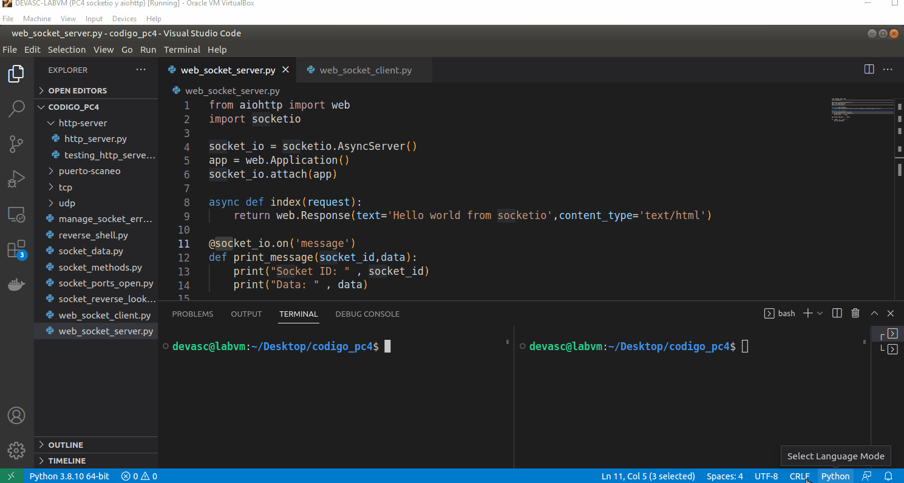
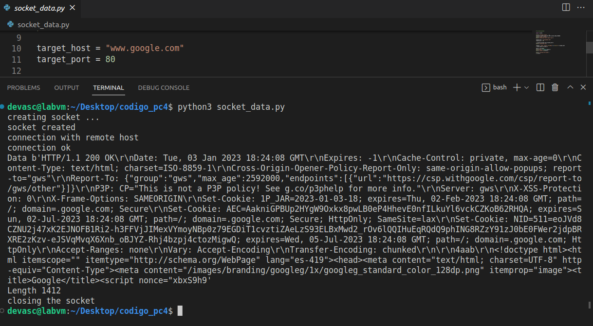
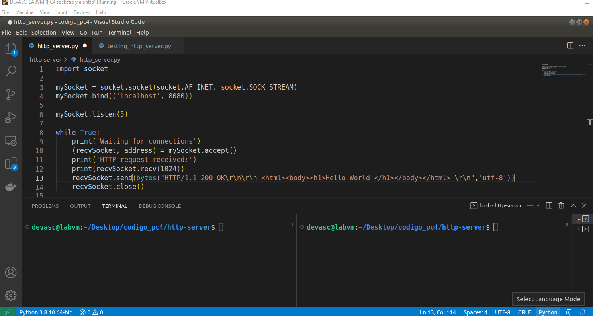
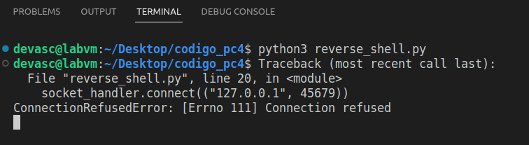
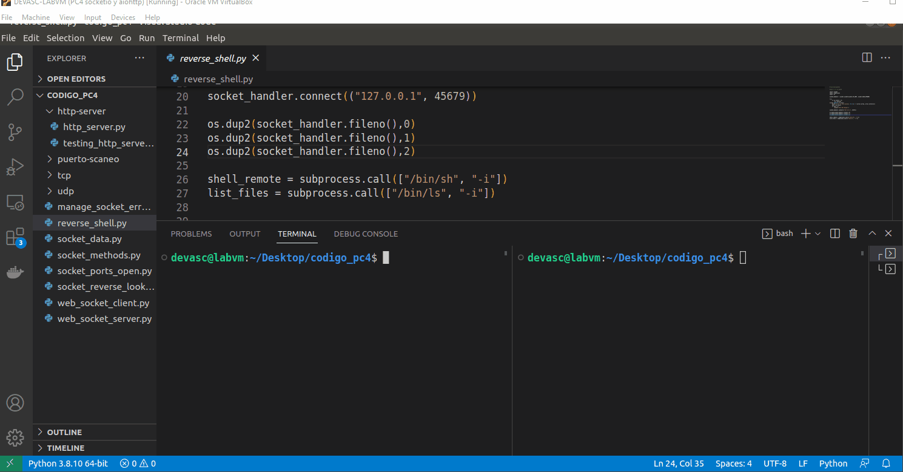
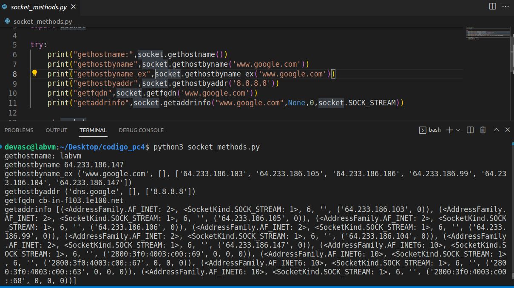

# Práctica Calificada 4. Programando sockets

> Los sockets de red son una forma sencilla de establecer contacto entre procesos en una misma máquina o en máquinas diferentes.

Primero instalamos las librerías de Socket.IO y AIOHTTP con los siguientes comandos:

```
pip3 install python-socketio
pip3 install aiohttp
```


## Implementación de un servidor 

Se implementa un servidor con socketio y un cliente con socketio y aiohttp:



## Cliente básico 

Se crea un cliente básico con el módulo socket que hace una solicitud a un servidor de Google:




## Servidor HTTP

Comprobamos que el servidor HTTP acepta conexiones desde la misma máquina usando el localhost:



## Shell inverso

El código del shell inverso no funciona porque no se activó el servidor de netcat. El mensaje de error dice que se rechaza la conexión:



Activamos el servidor y ahora sí se establece la conexión:




## Resolución de dominios

Obtenemos información de los servidores DNS de Google con los métodos que nos proporciona socketio. Por ejemplo, traducimos nombre de dominio <www.google.com> a su dirección IPv4 asociada <64.233.186.147>.



## Comando de búsqueda inversa

